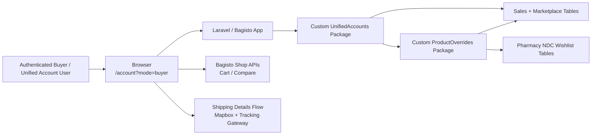
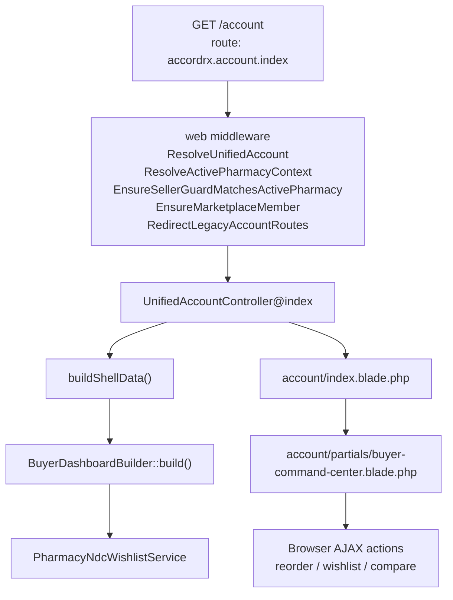
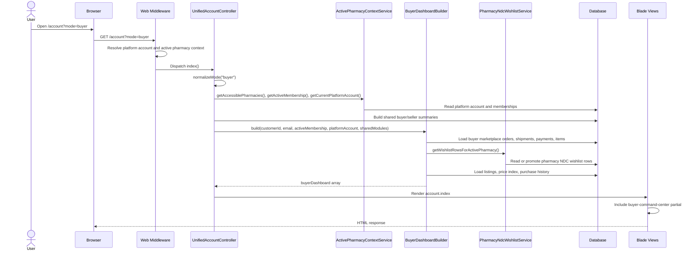
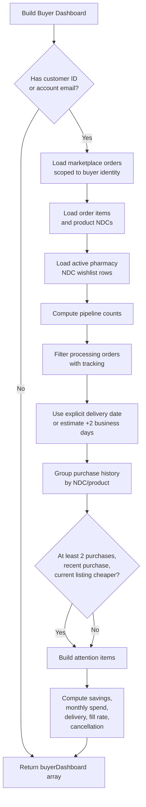
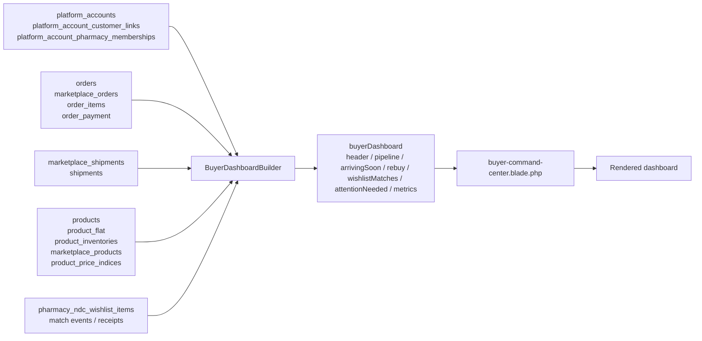
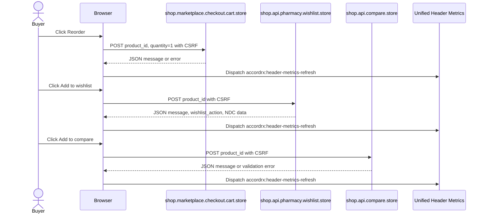

# Feature Documentation: Buyer Dashboard

## 1. Overview

The Buyer Dashboard is the buyer-mode view of the unified account dashboard at `/account?mode=buyer`, served by the route `accordrx.account.index`.

It gives an authenticated AccordRx buyer a consolidated operational view of purchasing activity across marketplace sellers. The page shows:

- order pipeline counts: Awaiting, Ready to Ship, In Transit, Delivered, Exceptions

- tracked processing orders in an “Arriving Soon” calendar and card list

- rebuy opportunities based on repeated purchase history and cheaper active marketplace listings

- active pharmacy NDC wishlist matches

- buyer attention items such as stuck pending orders, delayed shipments, and payment issues

- buyer marketplace metrics such as monthly spend, delivery time, wishlist fill rate, cancellation rate, and savings percentage

The feature solves the problem of buyer workflow fragmentation. Previously, buyer context lived across customer account pages, order history, wishlist, marketplace listings, cart, compare, and seller fulfillment data. The buyer dashboard gathers the most actionable signals into one server-rendered command center without replacing the underlying order, wishlist, cart, or shipping-detail flows.

Primary actors and systems:

- authenticated customer users

- authenticated seller users acting through unified account context

- platform accounts and pharmacy memberships

- Bagisto customer, sales, marketplace, checkout, wishlist, and compare modules

- custom `UnifiedAccounts` package

- custom `ProductOverrides` pharmacy NDC wishlist services

## 2. Goals and Design Intent

The implementation intentionally keeps the dashboard as a read-optimized, server-rendered view model instead of introducing a new dashboard persistence table. Most values are derived from existing operational data in `orders`, `marketplace_orders`, shipments, product inventory, marketplace listings, and NDC wishlist tables.

Key design decisions:

- The URL query parameter controls mode. `UnifiedAccountController::index()` reads `mode`, normalizes invalid values to `main`, and does not persist dashboard mode in session. This avoids stale buyer/seller context leaking between navigation events.

- The buyer dashboard is built only when `mode === 'buyer'`. The shell still builds common account, pharmacy, seller, buyer summary, and shared module URL data.

- `BuyerDashboardBuilder` owns buyer-specific aggregation and formatting. The Blade partial renders the resulting array and does not run database queries.

- The dashboard reuses existing Bagisto and custom flows for actions. Reorder posts to marketplace cart, wishlist posts to pharmacy wishlist, compare posts to Bagisto compare.

- The builder uses `Schema::hasTable()` and `Schema::hasColumn()` checks around optional tables and shipment fields. This makes the feature tolerant of partially migrated local or staging environments.

- Wishlist matching is pharmacy-context scoped through `PharmacyNdcWishlistService`, not a generic customer wishlist.

- Rebuy is intentionally conservative: a product/NDC must have at least two prior purchases, at least one purchase in the last 90 days, and a currently available listing priced below the last paid price.

Non-goals and constraints:

- The page does not persist dashboard snapshots.

- The page does not currently run through queues or async materialization.

- The “Review Matches” button is rendered disabled; the feature surfaces summary counts but does not yet link to a dedicated matches review flow from this panel.

- Receipt confirmation and buyer issue report hooks exist in `BuyerDashboardBuilder`, but currently return empty collections.

- The dashboard does not include client-side auto-refresh for its main panels. Header metrics can refresh after AJAX actions.

Security, performance, scalability, and maintainability considerations:

- Authentication is enforced by route middleware and controller fallback checks.

- Buyer order data is scoped by customer ID and/or platform-account email.

- Active pharmacy context controls NDC wishlist visibility.

- Aggregations are implemented with grouped queries and subqueries rather than per-row model loading where practical.

- There is no cache layer. Large accounts with many historical orders may need query tuning, indexes, or materialized summaries later.

- The builder is isolated enough to add unit/feature coverage without rendering the full account shell.

## 3. Architecture Context

The feature sits inside the `Custom/UnifiedAccounts` package and renders through the existing Bagisto storefront/theme stack.

Application boundary:

- Inside application:

  - `Custom\UnifiedAccounts\Http\Controllers\UnifiedAccountController`

  - `Custom\UnifiedAccounts\Services\BuyerDashboardBuilder`

  - `Custom\ProductOverrides\Services\PharmacyNdcWishlistService`

  - Bagisto sales, marketplace, checkout, customer, compare, wishlist modules

  - Laravel session, guards, middleware, Blade rendering, Eloquent/query builder

- External or infrastructure dependencies:

  - database

  - browser `fetch()` for dashboard action buttons

  - optional Reverb/Broadcasting for unified header updates outside the dashboard panels

  - optional Mapbox/shipping tracking services when the buyer follows a Track link to shipping details

Relevant modules and files:

- <a href="/Users/jerryvoelker/Herd/accordrx/packages/Custom/UnifiedAccounts/src/Routes/web.php" target="_blank" rel="noopener noreferrer">Routes/web.php</a>: defines `/account`, buyer shipping details, settings, messages, notifications, and related account routes.

- <a href="/Users/jerryvoelker/Herd/accordrx/packages/Custom/UnifiedAccounts/src/Http/Controllers/UnifiedAccountController.php" target="_blank" rel="noopener noreferrer">UnifiedAccountController.php</a>: resolves mode, builds shell data, calls `BuyerDashboardBuilder`.

- <a href="/Users/jerryvoelker/Herd/accordrx/packages/Custom/UnifiedAccounts/src/Services/BuyerDashboardBuilder.php" target="_blank" rel="noopener noreferrer">BuyerDashboardBuilder.php</a>: builds buyer dashboard view model.

- <a href="/Users/jerryvoelker/Herd/accordrx/packages/Custom/UnifiedAccounts/src/Resources/views/account/index.blade.php" target="_blank" rel="noopener noreferrer">index.blade.php</a>: renders the unified account shell, hero, tabs, and mode-specific partial.

- <a href="/Users/jerryvoelker/Herd/accordrx/packages/Custom/UnifiedAccounts/src/Resources/views/account/partials/buyer-command-center.blade.php" target="_blank" rel="noopener noreferrer">buyer-command-center.blade.php</a>: renders the buyer dashboard panels and AJAX action handlers.

- <a href="/Users/jerryvoelker/Herd/accordrx/packages/Custom/UnifiedAccounts/src/Services/ActivePharmacyContextService.php" target="_blank" rel="noopener noreferrer">ActivePharmacyContextService.php</a>: resolves platform account, active membership, and pharmacy context.

- <a href="/Users/jerryvoelker/Herd/accordrx/packages/Custom/UnifiedAccounts/src/Http/Middleware/ResolveUnifiedAccount.php" target="_blank" rel="noopener noreferrer">ResolveUnifiedAccount.php</a>: hydrates or provisions unified account context from customer/seller sessions.

- <a href="/Users/jerryvoelker/Herd/accordrx/packages/Custom/UnifiedAccounts/src/Http/Middleware/RedirectLegacyAccountRoutes.php" target="_blank" rel="noopener noreferrer">RedirectLegacyAccountRoutes.php</a>: redirects legacy customer account routes to `/account?mode=buyer`.

- <a href="/Users/jerryvoelker/Herd/accordrx/packages/Custom/ProductOverrides/src/Services/PharmacyNdcWishlistService.php" target="_blank" rel="noopener noreferrer">PharmacyNdcWishlistService.php</a>: resolves active pharmacy wishlist rows and NDC listing matches.

- <a href="/Users/jerryvoelker/Herd/accordrx/packages/Custom/UnifiedAccounts/src/Http/Controllers/OrderDetailsController.php" target="_blank" rel="noopener noreferrer">OrderDetailsController.php</a>: serves Track links through buyer shipping details.

## 4. Architecture Diagrams

### High-Level System Context



This shows the buyer dashboard as an authenticated browser experience backed by Laravel/Bagisto and custom packages. The initial page render reads from the database through `UnifiedAccounts` and `ProductOverrides`; action buttons reuse existing shop APIs.

### Component Architecture



The route is thin. The controller builds shared shell context and delegates buyer-specific computation to `BuyerDashboardBuilder`. Rendering is split between the common account shell and the buyer partial.

### Request Sequence



This is the primary render flow. It matters because most dashboard behavior is resolved server-side before HTML is returned.

### Business Logic Process Flow



This diagram summarizes the core decisions inside `BuyerDashboardBuilder`. It highlights the major derived sections and eligibility rules.

### Data Flow



The buyer dashboard is a derived view model. It reads many operational tables but only writes during GET indirectly if `PharmacyNdcWishlistService` promotes legacy customer wishlist rows into pharmacy NDC wishlist rows.

### Action Flow



The dashboard does not implement new cart, wishlist, or compare business logic. It acts as a compact launcher for existing endpoints.

## 5. End-to-End Flow

1. The user requests `/account?mode=buyer`.

2. Laravel applies the package web middleware registered in `UnifiedAccountsServiceProvider`:

   - `ResolveUnifiedAccount`

   - `ResolveActivePharmacyContext`

   - `EnsureSellerGuardMatchesActivePharmacy`

   - `EnsureMarketplaceMember`

   - `RedirectLegacyAccountRoutes`

3. The route `GET account` maps to `UnifiedAccountController::index()` and requires `theme` plus `auth:customer,seller`.

4. `UnifiedAccountController::index()` calls `authRedirect()`. If neither customer nor seller guard is authenticated, the user is redirected to `accordrx.auth.login`.

5. The controller normalizes `mode`. Valid modes are `main`, `buyer`, and `seller`; anything else falls back to `main`.

6. `buildShellData()` resolves:

   - accessible pharmacy memberships

   - active pharmacy membership

   - platform account

   - seller IDs

   - seller summaries

   - buyer summary

   - shared module URLs

   - main dashboard data

   - buyer dashboard data only when `mode === 'buyer'`

7. For buyer mode, the controller calls:

   ```php
   $this->buyerDashboardBuilder->build(
       customerId: (int) ($customerId ?: 0),
       accountEmail: $accountEmail,
       activeMembership: $activeMembership,
       platformAccount: $platformAccount,
       sharedModules: $sharedModules,
   )

   ```

8. `BuyerDashboardBuilder` loads buyer marketplace orders from `marketplace_orders` joined to `orders`, seller metadata, shipment stats, payment details, and refunded-item stats. Scope is applied by `orders.customer_id` and/or lowercased `orders.customer_email`.

9. The builder loads order items, product display names, NDC values from `product_inventories`, active pharmacy wishlist rows, and purchase match keys.

10. It derives dashboard sections:

    - `pipeline`

    - `arrivingSoon`

    - `rebuy`

    - `wishlistMatches`

    - `attentionNeeded`

    - `marketplaceMetrics`

11. The controller renders `unified-accounts::account.index`.

12. `account/index.blade.php` selects the buyer hero and includes `unified-accounts::account.partials.buyer-command-center`.

13. The browser receives server-rendered HTML. Dashboard action buttons are handled by inline JavaScript in the partial.

Alternate and edge flows:

- Invalid `mode`: normalized to `main`; buyer dashboard is not built.

- No customer ID and no account email: buyer builder returns empty/zero-derived data.

- Missing optional tables: builder returns empty collections or zero metrics instead of failing where `Schema::hasTable()` guards exist.

- Missing shipment ETA fields: delivery date is estimated as two business days after shipment creation.

- Processing order with no tracking: counted as Ready to Ship, not Arriving Soon.

- Processing order with tracking but no delivery estimate and no shipment creation date: excluded from Arriving Soon cards because no expected delivery date can be resolved.

- Completed orders: counted as Delivered but excluded from Arriving Soon even if shipment data exists.

- Pending orders older than 48 hours: surfaced as `stuck_awaiting_seller`.

- Pending payment orders: surfaced as `payment_issue`, with error text extracted from `order_payment.additional` when available.

- Attention list: capped at six items.

- Rebuy: excluded unless repeated purchase, recent purchase, available approved listing, positive inventory, and cheaper current listing all pass.

- Wishlist rows without matches: counted as zero matches.

- Reorder/wishlist/compare AJAX failures: button is re-enabled and a local error toast is shown; there is no automatic retry.

## 6. Code-Level Implementation

Main route:

- <a href="/Users/jerryvoelker/Herd/accordrx/packages/Custom/UnifiedAccounts/src/Routes/web.php" target="_blank" rel="noopener noreferrer">Routes/web.php</a>

  - `GET account` -> `UnifiedAccountController@index`, route name `accordrx.account.index`.

  - Route group uses `theme` and `auth:customer,seller`.

  - Related buyer shipping routes live under `customer/account/orders`.

Controller:

- <a href="/Users/jerryvoelker/Herd/accordrx/packages/Custom/UnifiedAccounts/src/Http/Controllers/UnifiedAccountController.php" target="_blank" rel="noopener noreferrer">UnifiedAccountController.php</a>

  - `index(Request $request)`: authenticates, normalizes mode, builds shell data, returns `account.index`.

  - `buildShellData(Request $request, string $mode)`: resolves account, memberships, summaries, shared URLs, and mode-specific dashboard payloads.

  - `normalizeMode(string $mode)`: allows only `main`, `buyer`, `seller`.

  - `authRedirect()`: redirects unauthenticated users to unified login.

  - `safeRedirectUrl()`: local/same-host redirect protection used by related account mutation flows.

Buyer dashboard service:

- <a href="/Users/jerryvoelker/Herd/accordrx/packages/Custom/UnifiedAccounts/src/Services/BuyerDashboardBuilder.php" target="_blank" rel="noopener noreferrer">BuyerDashboardBuilder.php</a>

  - `build()`: orchestration method returning the full `buyerDashboard` array.

  - `loadBuyerMarketplaceOrders()`: loads buyer marketplace orders, seller names, shipment stats, payment details, and refund flags.

  - `buildShipmentStatsSubquery()`: aggregates tracking and optional ETA/delivery/status shipment fields.

  - `loadOrderItemsByOrderId()`: loads display product names, quantities, prices, and NDC values for order cards.

  - `buildCalendarDays()`: creates a current-week-through-30-days calendar model for delivery events.

  - `formatArrivingSoonCard()`: creates the card payload including Track URL.

  - `buildRebuyCards()`: groups purchase history and selects at most two eligible rebuy opportunities.

  - `resolveRebuyListing()`: prefers NDC listings via `PharmacyNdcWishlistService`, then falls back to marketplace product lookup by product ID.

  - `buildWishlistMatchesSummary()`: counts matched NDC wishlist rows, below-target matches, and low-stock matches.

  - `buildAttentionNeeded()`: emits stuck pending orders, delayed shipments, and payment issues.

  - `buildMarketplaceMetrics()`: computes savings, monthly spend, order count, delivery time, fill rate, and cancellation rate.

  - `applyBuyerIdentityScope()`: scopes queries by customer ID and/or lowercased email.

Views:

- <a href="/Users/jerryvoelker/Herd/accordrx/packages/Custom/UnifiedAccounts/src/Resources/views/account/index.blade.php" target="_blank" rel="noopener noreferrer">account/index.blade.php</a>

  - Renders the account hero, Main/Buyer/Seller tabs, and mode-specific partials.

  - Uses `buyerDashboard['header']` for buyer hero copy.

  - Includes `buyer-command-center` when `$mode === 'buyer'`.

- <a href="/Users/jerryvoelker/Herd/accordrx/packages/Custom/UnifiedAccounts/src/Resources/views/account/partials/buyer-command-center.blade.php" target="_blank" rel="noopener noreferrer">buyer-command-center.blade.php</a>

  - Renders the pipeline cards, Arriving Soon calendar/cards, Reorder/Rebuy cards, Wishlist Matches, Attention Needed, and Marketplace Metrics.

  - Defines inline styles for this dashboard.

  - Defines inline JavaScript for:

    - `data-buyer-reorder`

    - `data-buyer-wishlist`

    - `data-buyer-compare`

  - Uses CSRF token and same-origin credentials for AJAX POSTs.

Context and middleware:

- <a href="/Users/jerryvoelker/Herd/accordrx/packages/Custom/UnifiedAccounts/src/Http/Middleware/ResolveUnifiedAccount.php" target="_blank" rel="noopener noreferrer">ResolveUnifiedAccount.php</a>

  - Resolves session platform account.

  - Verifies customer email matches platform account email.

  - Verifies seller sessions are linked through `platform_account_pharmacy_memberships`.

  - Provisions or hydrates account context when possible.

- <a href="/Users/jerryvoelker/Herd/accordrx/packages/Custom/UnifiedAccounts/src/Services/ActivePharmacyContextService.php" target="_blank" rel="noopener noreferrer">ActivePharmacyContextService.php</a>

  - Provides current platform account, accessible pharmacies, and active membership.

  - Validates pharmacy switch requests.

  - Writes `last_active_pharmacy_seller_id` and active session keys after successful switch.

- <a href="/Users/jerryvoelker/Herd/accordrx/packages/Custom/UnifiedAccounts/src/Http/Middleware/RedirectLegacyAccountRoutes.php" target="_blank" rel="noopener noreferrer">RedirectLegacyAccountRoutes.php</a>

  - Redirects legacy customer account routes such as `shop.customers.account.index` to `accordrx.account.index` with `mode=buyer`.

  - Preserves unrelated query parameters.

  - Allows selected legacy order task links to pass through.

NDC wishlist integration:

- <a href="/Users/jerryvoelker/Herd/accordrx/packages/Custom/ProductOverrides/src/Services/PharmacyNdcWishlistService.php" target="_blank" rel="noopener noreferrer">PharmacyNdcWishlistService.php</a>

  - Resolves active pharmacy context.

  - Loads active pharmacy NDC wishlist rows.

  - Finds marketplace listings for a normalized NDC.

  - Toggles product wishlist rows through the `shop.api.pharmacy.wishlist.store` endpoint.

Shipping details integration:

- <a href="/Users/jerryvoelker/Herd/accordrx/packages/Custom/UnifiedAccounts/src/Http/Controllers/OrderDetailsController.php" target="_blank" rel="noopener noreferrer">OrderDetailsController.php</a>

  - `showBuyerShippingDetails()` backs dashboard Track links.

  - `resolveBuyerOrder()` ensures the requested order belongs to the authenticated customer or platform account customer link.

  - `storeBuyerRefundRequest()` and `storeBuyerOrderMessage()` support related buyer order workflows.

## 7. Data Model and Persistence

The buyer dashboard itself does not define a dedicated table. It derives state from existing tables.

Unified account identity tables:

- `platform_accounts`

  - created by `2026_02_22_120000_create_platform_accounts_table.php`

  - important columns: `email`, `password`, `first_name`, `last_name`, `status`, `last_active_pharmacy_seller_id`, `last_login_at`

  - `email` is unique

  - `last_active_pharmacy_seller_id` references `marketplace_sellers.id`

- `platform_account_customer_links`

  - created by `2026_02_22_120100_create_platform_account_customer_links_table.php`

  - links one platform account to one Bagisto customer

  - `customer_id` is unique

  - used to resolve buyer customer ID from a platform account

- `platform_account_pharmacy_memberships`

  - created by `2026_02_22_120200_create_platform_account_pharmacy_memberships_table.php`

  - links a platform account to pharmacy seller context

  - unique key: `platform_account_id + pharmacy_seller_id`

  - important columns: `pharmacy_seller_id`, `actor_seller_id`, `role_key`, `marketplace_role_id`, `membership_status`

Buyer order and fulfillment tables:

- `orders`

  - read for buyer identity, order status, totals, timestamps, currency, payment/refund status

  - optional `buyer_pharmacy_seller_id` added by `2026_02_22_120400_add_buyer_pharmacy_seller_id_to_cart_orders_shipments.php`

  - dashboard scopes order queries by `customer_id` and/or `customer_email`

- `marketplace_orders`

  - read for seller-specific order status and `marketplace_seller_id`

  - pipeline counts use marketplace order status

- `marketplace_shipments` and `shipments`

  - read for tracking number, carrier, shipment creation time, optional ETA/delivery/status columns

  - the builder supports optional shipment columns:

    - `expected_delivery_date`

    - `estimated_delivery_date`

    - `delivery_date`

    - `eta`

    - `delivered_at`

    - `delivery_completed_at`

    - `tracking_status`

    - `delivery_status`

- `order_payment`

  - read for `additional` JSON/string data

  - payment issue text is extracted from keys such as `error_message`, `failure_message`, `reason`, or `payment_status`

- `order_items`

  - read for product purchase history, quantities, base prices, refunded/canceled quantities, and rebuy logic

Product and listing tables:

- `products`

- `product_flat`

- `product_inventories`

  - read for product display names, NDC values, and inventory quantity

- `marketplace_products`

  - read for approved active listings, listing price, channel scoping, seller scoping, and rebuy availability

- `product_price_indices`

  - read for savings percentage calculations against `regular_min_price`

Wishlist and compare tables:

- `pharmacy_ndc_wishlist_items`

  - created by `ProductOverrides` migration `2026_03_09_130000_create_pharmacy_ndc_wishlist_items_table.php`

  - unique key: `pharmacy_seller_id + channel_id + ndc_normalized`

  - read by dashboard wishlist match summary

  - written indirectly if legacy customer wishlist rows are promoted during `getWishlistRowsForActivePharmacy()`

  - written directly by the dashboard Add to wishlist action through `PharmacyWishlistController::store()`

- `pharmacy_ndc_wishlist_match_events` and `pharmacy_ndc_wishlist_match_receipts`

  - required by `wishlistTablesReady()`

  - used by the wishlist service for unread match data outside the buyer summary

- `compare_items`

  - written by the dashboard Add to compare action through Bagisto `CompareController::store()`

Cart persistence:

- `cart`

  - written by the Reorder action through marketplace cart store endpoint

  - optional `buyer_pharmacy_seller_id` supports active pharmacy scoped cart behavior

Important invariants:

- Buyer dashboard order data must be scoped by buyer identity.

- Wishlist rows must be scoped to active pharmacy context, not just customer ID.

- Rebuy candidates must reference available, approved, non-suspended sellers and positive inventory.

- Pharmacy NDC wishlist uniqueness is enforced by normalized NDC, pharmacy seller, and channel.

- The builder is expected to return empty arrays/zero metrics rather than throw when optional data is unavailable.

Caching/search/object storage:

- The buyer dashboard has no dedicated cache, search index, or object storage usage.

- Product names come from `product_flat` for current locale and channel when available.

## 8. Integration Points

### Unified account route

- Purpose: render the buyer dashboard inside the unified account shell.

- Direction: browser -> application.

- Contract: `GET /account?mode=buyer`.

- Failure handling: unauthenticated users redirect to `accordrx.auth.login`; invalid mode falls back to main dashboard.

- Security: `auth:customer,seller`, web session, CSRF for subsequent POST actions.

### Legacy account redirects

- Purpose: move customer account entry points into unified account buyer mode.

- Direction: browser legacy route -> middleware redirect.

- Contract: mapped route names such as `shop.customers.account.index` redirect to `accordrx.account.index` with `mode=buyer`.

- Failure handling: unmapped routes, unauthenticated users, disabled flags, and guard mismatches pass through.

- Security: guard-specific redirect checks prevent customer sessions from being redirected to seller pages and vice versa.

### `PharmacyNdcWishlistService`

- Purpose: provide active pharmacy NDC wishlist rows and matching marketplace listings.

- Direction: `BuyerDashboardBuilder` -> service -> database.

- Contract:

  - `getWishlistRowsForActivePharmacy(): Collection`

  - `getListingsForNdc(string $ndcNormalized, ?int $minDatingDays = null, ?float $maxPrice = null): Collection`

- Failure handling: returns empty collections when schema/context is unavailable.

- Security: active pharmacy context is resolved from platform account, membership, session, and seller guard context.

- Side effect: may promote legacy `wishlist` product rows into `pharmacy_ndc_wishlist_items`.

### Marketplace cart endpoint

- Purpose: dashboard Reorder button adds one unit of a rebuy product to cart.

- Direction: browser -> app.

- Route: `shop.marketplace.checkout.cart.store`.

- Request payload:

  ```php
  {
    "product_id": 123,
    "quantity": 1
  }

  ```

- Response: JSON message from Bagisto/Marketplace cart controller.

- Failure handling: browser catches non-2xx responses, shows toast, and re-enables button.

- Security: CSRF token, same-origin credentials, product/cart validation in existing marketplace cart endpoint.

### Pharmacy wishlist endpoint

- Purpose: dashboard Add to wishlist button toggles product NDC in active pharmacy wishlist.

- Direction: browser -> app.

- Route: `shop.api.pharmacy.wishlist.store`.

- Request payload:

  ```php
  {
    "product_id": 123
  }

  ```

- Response payload shape from `PharmacyWishlistController::store()`:

  ```php
  {
    "message": "Wishlist updated message",
    "wishlist_action": "added",
    "ndc": "11111-1111-11",
    "ndc_normalized": "11111111111",
    "wishlist_item_id": 456
  }

  ```

- Failure handling: runtime exceptions are returned as JSON resources with a message; the browser displays the message as an error toast when the HTTP response is non-2xx.

- Security: route middleware `web` and `auth:customer,seller`; active pharmacy context is required.

### Compare endpoint

- Purpose: dashboard Add to compare button adds a product to Bagisto compare list.

- Direction: browser -> app.

- Route: `shop.api.compare.store`.

- Request payload:

  ```php
  {
    "product_id": 123
  }

  ```

- Response: success message or `422` if already added.

- Failure handling: browser displays endpoint message or fallback “Unable to update compare.”

- Security: uses current authenticated customer guard in Bagisto compare controller.

### Buyer shipping details

- Purpose: Track links from Arriving Soon cards show seller-specific shipment details for a buyer order.

- Direction: browser -> app.

- Route: `accordrx.account.orders.shipping.show`.

- Request path parameters: `buyerOrder`, `pharmacySeller`.

- Failure handling: `404` if the buyer order is not owned by the authenticated customer/platform customer link, or if no matching marketplace seller order exists.

- Security: route uses `shop` and `customer` middleware, and `resolveBuyerOrder()` checks allowed customer IDs.

### Header metrics refresh

- Purpose: update unified header badges after Reorder/Wishlist/Compare actions.

- Direction: browser local event -> header script -> app snapshot endpoint.

- Event: `accordrx:header-metrics-refresh`.

- Related route: `accordrx.account.realtime.header_metrics`.

- Failure handling: header behavior handles refresh separately; dashboard action toast is independent.

- Security: header snapshot checks account context and returns current platform account metrics when available.

### External tracking/geocoding

- Purpose: not used during initial dashboard build, but used when a Track link opens buyer shipping details.

- Direction: application -> external providers via `ShippingTrackingGateway` and `MapboxGeocodingService`.

- Configuration: `MAPBOX_PUBLIC_TOKEN` or `MAPBOX_ACCESS_TOKEN`; configured shipping methods/providers.

- Failure handling: shipping details builder falls back to origin data when current tracking location is unavailable.

- Security: public Mapbox token is exposed only for map rendering; access tokens/secrets should remain server-side.

## 9. Configuration and Environment Dependencies

Required for the dashboard to render correctly:

- `ACCORDRX_UNIFIED_ENABLED=true`

- `ACCORDRX_UNIFIED_LOGIN_ENABLED=true`

- `ACCORDRX_ACTIVE_PHARMACY_CONTEXT_ENABLED=true`

- migrated unified account tables

- migrated sales, marketplace, product, shipment, and wishlist tables

- Bagisto customer/seller guards configured

- marketplace package/routes enabled

- valid current channel and locale

Relevant feature flags in `config/accordrx-unified.php`:

- `ACCORDRX_UNIFIED_ENABLED`

- `ACCORDRX_UNIFIED_LOGIN_ENABLED`

- `ACCORDRX_ACTIVE_PHARMACY_CONTEXT_ENABLED`

- `ACCORDRX_STORE_SELECTOR_ENABLED`

- `ACCORDRX_PHARMACY_SCOPED_CART_ENABLED`

- `ACCORDRX_MEMBERS_ONLY_MARKETPLACE_ENABLED`

- `ACCORDRX_LEGACY_ACCOUNT_ROUTE_REDIRECTS_ENABLED`

- `ACCORDRX_LEGACY_ACCOUNT_ROUTE_REDIRECT_STATS_ENABLED`

- `ACCORDRX_LEGACY_ACCOUNT_ROUTE_BLOCK_ENABLED`

- `ACCORDRX_AUTO_CREATE_SHADOW_CUSTOMER`

- `ACCORDRX_LEGACY_SELLER_SESSION_SHIM_ENABLED`

Useful supporting environment variables:

- `DB_CONNECTION`, `DB_HOST`, `DB_DATABASE`, `DB_USERNAME`, `DB_PASSWORD`

- `QUEUE_CONNECTION`

- `BROADCAST_CONNECTION`, `REVERB_*`, `VITE_REVERB_*` for realtime header features

- `MAPBOX_PUBLIC_TOKEN` / `MAPBOX_ACCESS_TOKEN` for shipping details map rendering

- `LOG_CHANNEL`, `LOG_LEVEL` for troubleshooting

- `ALGOLIA_APP_ID`, `ALGOLIA_SECRET` are not directly required by the buyer dashboard but may affect adjacent search/listing experiences

Local/staging/production prerequisites:

- Run package migrations from `Custom/UnifiedAccounts` and `Custom/ProductOverrides`.

- Ensure customer and seller accounts are linked through `platform_accounts`, `platform_account_customer_links`, and `platform_account_pharmacy_memberships`.

- Ensure product inventory rows contain NDC values where wishlist and rebuy behavior is expected.

- Ensure marketplace products have approved sellers, approved listings, active status, inventory quantity, and channel alignment.

- Ensure `APP_URL` is correct because `safeRedirectUrl()` uses it for same-host redirect validation.

## 10. Security and Risk Considerations

Authentication:

- `/account` requires `auth:customer,seller`.

- `UnifiedAccountController::authRedirect()` redirects unauthenticated access to unified login.

- Dashboard action POSTs include CSRF token and same-origin credentials.

Authorization and scoping:

- Buyer order queries in `BuyerDashboardBuilder` use `applyBuyerIdentityScope()` with `orders.customer_id` and/or lowercased `orders.customer_email`.

- `ResolveUnifiedAccount` rejects session platform accounts when the authenticated customer email does not match the platform account email.

- `ResolveUnifiedAccount` rejects seller sessions not linked to the platform account through `platform_account_pharmacy_memberships`.

- Active pharmacy switching requires an active membership and active seller/pharmacy records.

- Buyer shipping details use `resolveBuyerOrder()` to ensure the order belongs to the authenticated customer or linked platform account customer.

Sensitive data:

- The dashboard displays medication/product names, NDC-derived wishlist signals, order numbers, seller names, delivery timing, and payment issue summaries.

- `order_payment.additional` can contain sensitive processor error data. Current implementation extracts generic error-message-like strings. Avoid adding raw dumps of `payment_additional` to the UI or logs.

- Order and medication data should be treated as sensitive operational healthcare commerce data.

Trust boundaries:

- Query string `mode` is untrusted and normalized.

- Browser action payloads are untrusted and validated by downstream endpoints.

- `redirect_to` in related account flows is untrusted and constrained to relative or same-host URLs.

- Seller and customer guards can both be authenticated; guard mismatch checks prevent cross-context redirects.

Known risks and technical debt:

- The dashboard has no dedicated rate limiting on its GET route beyond normal web middleware.

- Large order histories may make dashboard rendering slower because all metrics are computed live.

- Rebuy uses purchase history plus current marketplace listing price; incorrect product/NDC mapping can produce misleading opportunities.

- Buyer dashboard action buttons do not retry transient failures.

- The “Review Matches” button is disabled, which may confuse users expecting a drill-in path.

- Receipt confirmation and buyer issue report support are stubbed in the builder.

## 11. Observability and Operations

Current observability:

- `ActivePharmacyContextService` logs successful and denied context switches with event names such as:

  - `unified_context_switch.success`

  - `unified_context_switch.denied`

- `RedirectLegacyAccountRoutes` can record legacy redirect stats through `LegacyRouteRedirectStatsService` when `ACCORDRX_LEGACY_ACCOUNT_ROUTE_REDIRECT_STATS_ENABLED=true`.

- Dashboard build failures bubble into normal Laravel logging/reporting.

- Reorder/Wishlist/Compare client errors are shown as browser toasts but are not separately logged by the dashboard partial.

- Header metrics can be refreshed through the existing unified header snapshot route.

Troubleshooting checklist:

- If `/account?mode=buyer` redirects to login:

  - verify customer or seller guard is authenticated

  - verify session is not expired

  - verify unified login/session bootstrap is working

- If buyer dashboard shows zero orders:

  - verify `orders.customer_id` matches the linked customer

  - verify `orders.customer_email` matches platform account email

  - verify matching rows exist in `marketplace_orders`

  - verify `mode=buyer` is present and not misspelled

- If Arriving Soon is empty:

  - verify marketplace order status is `processing`

  - verify shipment has a non-empty `track_number`

  - verify shipment creation date or ETA-like columns are populated

  - verify the order is not completed

- If Track links are missing:

  - verify route `accordrx.account.orders.shipping.show` exists

  - verify buyer order ID and marketplace seller ID are present

  - verify matching `marketplace_orders.order_id + marketplace_seller_id` exists

- If wishlist matches are empty:

  - verify active pharmacy context

  - verify `pharmacy_ndc_wishlist_items` rows exist for pharmacy/channel

  - verify `product_inventories.ndcno` normalizes to the same NDC

  - verify marketplace listing is approved, seller is approved/non-suspended, product is active, and quantity is positive

- If Rebuy is empty:

  - verify at least two prior purchases exist for the same NDC or product

  - verify at least one purchase is within the last 90 days

  - verify current listing price is lower than the latest paid price

  - verify listing inventory is positive and listing/seller are approved

Operational runbook notes:

- Use Laravel logs for server-side exceptions.

- Use browser devtools Network tab for Reorder/Wishlist/Compare AJAX failures.

- Use `php artisan route:list` to confirm route names if generated links are missing.

- Use database queries against `orders`, `marketplace_orders`, `marketplace_shipments`, `shipments`, `pharmacy_ndc_wishlist_items`, and `marketplace_products` to validate source data.

## 12. Testing and Quality Coverage

Primary test files:

- <a href="/Users/jerryvoelker/Herd/accordrx/packages/Webkul/Shop/tests/Feature/UnifiedAccounts/BuyerDashboardBuilderTest.php" target="_blank" rel="noopener noreferrer">BuyerDashboardBuilderTest.php</a>

  - verifies top-level dashboard keys

  - zero-state pipeline

  - pipeline counts by marketplace status

  - buyer isolation from other customers’ orders

  - attention rules for stuck pending orders and payment issues

  - attention cap at six items

  - rebuy eligibility requirements

  - Arriving Soon exclusion and Track URL generation

  - wishlist match zero state

- <a href="/Users/jerryvoelker/Herd/accordrx/packages/Webkul/Shop/tests/Feature/UnifiedAccounts/UnifiedAccountMainDashboardTest.php" target="_blank" rel="noopener noreferrer">UnifiedAccountMainDashboardTest.php</a>

  - verifies `/account` defaults to main mode

  - verifies buyer and seller modes render expected content

  - verifies invalid mode falls back to main

  - verifies buyer command center content and computed dashboard data

  - verifies buyer Track URL rendering

  - verifies customer-only unified sessions still populate buyer dashboard counts

- <a href="/Users/jerryvoelker/Herd/accordrx/packages/Webkul/Shop/tests/Feature/UnifiedAccounts/DashboardTestHelpers.php" target="_blank" rel="noopener noreferrer">DashboardTestHelpers.php</a>

  - creates reusable customer, seller, platform account, membership, order, marketplace order, shipment, product/listing, NDC wishlist, and price index fixtures

- <a href="/Users/jerryvoelker/Herd/accordrx/tests/Feature/UnifiedAccounts/RedirectLegacyAccountRoutesTest.php" target="_blank" rel="noopener noreferrer">RedirectLegacyAccountRoutesTest.php</a>

  - verifies legacy customer account routes redirect to `/account?mode=buyer`

  - verifies guard mismatch passthrough

  - verifies query preservation and block-mode behavior

- <a href="/Users/jerryvoelker/Herd/accordrx/tests/Feature/UnifiedAccounts/UnifiedAccountsAuthContextTest.php" target="_blank" rel="noopener noreferrer">UnifiedAccountsAuthContextTest.php</a>

  - verifies active pharmacy switch rejects non-member pharmacies

  - verifies no-active-membership login failure behavior

  - verifies sequential pharmacy switches persist the final active pharmacy

- <a href="/Users/jerryvoelker/Herd/accordrx/tests/Feature/UnifiedAccounts/UnifiedOpenRedirectTest.php" target="_blank" rel="noopener noreferrer">UnifiedOpenRedirectTest.php</a>

  - verifies unsafe `redirect_to` values are rejected in related context-switch flows

- <a href="/Users/jerryvoelker/Herd/accordrx/tests/Feature/UnifiedAccounts/UnifiedPharmacyScopedCartTest.php" target="_blank" rel="noopener noreferrer">UnifiedPharmacyScopedCartTest.php</a>

  - verifies `buyer_pharmacy_seller_id` order scoping behavior where the column exists

How to run:

```php
composer run test:unified-accounts

```

Focused commands:

```php
./vendor/bin/pest packages/Webkul/Shop/tests/Feature/UnifiedAccounts/BuyerDashboardBuilderTest.php --compact
./vendor/bin/pest packages/Webkul/Shop/tests/Feature/UnifiedAccounts/UnifiedAccountMainDashboardTest.php --compact
./vendor/bin/pest tests/Feature/UnifiedAccounts/RedirectLegacyAccountRoutesTest.php --compact
./vendor/bin/pest tests/Feature/UnifiedAccounts/UnifiedAccountsAuthContextTest.php --compact
./vendor/bin/pest tests/Feature/UnifiedAccounts/UnifiedOpenRedirectTest.php --compact
./vendor/bin/pest tests/Feature/UnifiedAccounts/UnifiedPharmacyScopedCartTest.php --compact

```

Setup and seed data:

- The feature tests use helper-created data rather than relying on production seeders.

- `BuyerCommandCenterDemoSeeder` can seed demo data for local manual review and explicitly points users to `/account?mode=buyer`.

- Tests set important config flags such as:

  - `accordrx-unified.features.enabled`

  - `accordrx-unified.features.unified_login_enabled`

  - `accordrx-unified.features.active_pharmacy_context_enabled`

  - `accordrx-unified.features.members_only_marketplace_enabled`

Known coverage gaps:

- No dedicated browser/E2E test was found for clicking the dashboard Reorder/Wishlist/Compare buttons from the rendered page.

- The underlying endpoints have their own coverage, but dashboard-specific JavaScript behavior is not directly covered.

- No performance/load test was found for accounts with very large order histories.

- Receipt confirmation and buyer issue reports are not covered because the builder methods are currently stubs.

- No visual regression test was found for the buyer dashboard layout.

## 13. Example Scenarios

### Normal case: active buyer with orders and wishlist matches

A platform account has a linked customer, an active pharmacy membership, several marketplace orders, two tracked processing shipments, and pharmacy NDC wishlist rows.

Expected behavior:

- `/account?mode=buyer` renders Buyer Insights Center / Buyer Dashboard.

- Pending marketplace orders count under Awaiting.

- Processing orders without tracking count under Ready to Ship.

- Processing orders with tracking count under In Transit and appear in Arriving Soon.

- Completed marketplace orders count under Delivered.

- Canceled/refunded orders count under Exceptions.

- Rebuy cards appear only for repeated purchases with cheaper active listings.

- Wishlist Matches shows count, below-target count, and low-stock-risk count.

- Attention Needed shows stuck pending and payment issue entries.

### Edge case: new account with no buyer orders

A customer/platform account exists but has no `orders` or `marketplace_orders`.

Expected behavior:

- Buyer Dashboard renders successfully.

- Pipeline counts are all zero.

- Arriving Soon shows “No tracked processing orders are arriving in the current window yet.”

- Reorder/Rebuy shows no opportunities.

- Metrics show zero values.

- No exception is thrown.

### Edge case: customer-only unified session

The user is authenticated as a customer, the seller guard is logged out, and a platform account/customer link exists.

Expected behavior:

- Buyer dashboard still loads.

- Buyer order counts populate from linked customer identity.

- Session keeps `accordrx.unified_account_id`.

- Seller-specific dashboard context is not required for buyer order counts.

### Failure case: unrelated customer order

Another customer has five pending marketplace orders. The authenticated buyer has one pending order.

Expected behavior:

- The buyer dashboard Awaiting count is one, not six.

- Other customers’ orders do not bleed into the authenticated buyer’s view.

### Failure case: Reorder AJAX failure

The user clicks Reorder for a product that downstream cart validation rejects.

Expected behavior:

- Button becomes temporarily disabled during the request.

- Browser receives non-2xx JSON or invalid response.

- The dashboard shows an error toast such as “Unable to add item to cart.”

- Button is re-enabled.

- No dashboard-level retry occurs.

### Failure case: inactive or missing wishlist context

A buyer has no active pharmacy context or wishlist tables are missing.

Expected behavior:

- `PharmacyNdcWishlistService::getWishlistRowsForActivePharmacy()` returns an empty collection.

- Wishlist Matches renders zero counts.

- The dashboard page still loads.

## 14. Maintenance and Extension Guidance

Where to make changes:

- Add or change buyer metrics in `BuyerDashboardBuilder::buildMarketplaceMetrics()`.

- Add pipeline stages in `BuyerDashboardBuilder::build()` and update the switch icons in `buyer-command-center.blade.php`.

- Change Arriving Soon rules in `loadBuyerMarketplaceOrders()`, `resolveDeliveryWindow()`, `buildCalendarDays()`, and `formatArrivingSoonCard()`.

- Change Rebuy eligibility in `buildRebuyCards()` and `resolveRebuyListing()`.

- Change wishlist match rules in `buildWishlistMatchesSummary()` or in `PharmacyNdcWishlistService::getListingsForNdc()`.

- Add dashboard drill-in links through `sharedModules` in `UnifiedAccountController::buildShellData()` or directly in the buyer dashboard view model.

- Add new browser actions in `buyer-command-center.blade.php`, but prefer reusing existing APIs/controllers rather than embedding business logic in JavaScript.

Safe extension points:

- Extend the `buyerDashboard` array with new keys; the partial already uses defaults for missing keys.

- Add feature tests to `BuyerDashboardBuilderTest.php` for any new derived business rule.

- Add rendered HTML assertions to `UnifiedAccountMainDashboardTest.php` for visible UI changes.

- Add focused API tests if new dashboard buttons call new endpoints.

Risky areas:

- Buyer identity scoping. Be careful when changing `applyBuyerIdentityScope()` because it controls cross-customer data isolation.

- Active pharmacy context. Wishlist matches and wishlist mutations depend on active pharmacy, not just customer ID.

- Product/NDC matching. NDC normalization removes non-digits; inconsistent NDC formatting can affect wishlist and rebuy results.

- Live query performance. Avoid adding per-order database queries inside loops.

- Optional schema checks. Many environments may lack optional shipment fields; preserve schema guards when adding optional columns.

- Payment data display. Do not expose raw payment gateway payloads.

Common pitfalls:

- Assuming `/account` always means buyer mode. It defaults to main mode unless `mode=buyer` is present.

- Adding dashboard mode to session. The current code deliberately avoids session-persisted mode for navigation correctness.

- Treating Bagisto wishlist and pharmacy NDC wishlist as the same thing. Buyer dashboard wishlist summary uses pharmacy NDC wishlist logic.

- Adding Rebuy products without checking listing approval, seller approval, suspension status, product status, channel, and inventory.

- Linking Track cards directly to generic order pages when the dashboard needs seller-specific shipping details.

## 15. Open Questions / Follow-Up Work

Known limitations and likely follow-up work:

- Enable or link the disabled “Review Matches” button to the unified NDC wishlist/matches experience.

- Implement `buildReceiptConfirmationIssues()` if shipment proof/signature columns become part of buyer workflows.

- Implement `buildBuyerIssueReports()` if `order_issues`, `marketplace_order_issues`, or `shipment_issues` become active product requirements.

- Add browser/E2E coverage for dashboard Reorder, Wishlist, and Compare buttons.

- Add performance profiling for accounts with large order history.

- Consider caching or materializing dashboard aggregates if the page becomes slow in production.

- Consider explicit observability around dashboard build time and query count.

- Clarify whether `order_payment.additional` should be sanitized further before showing payment issue text.

- Consider adding direct tests for delayed shipment detection using optional shipment status/ETA columns.

- Consider replacing inline CSS/JS in the Blade partial with a shared asset if the component grows further.

## 16. Appendix

### Relevant Routes

```php
GET  /account
name: accordrx.account.index
controller: Custom\UnifiedAccounts\Http\Controllers\UnifiedAccountController@index
query: mode=buyer
middleware: web, theme, auth:customer,seller

```

```php
GET /customer/account/orders/{buyerOrder}/seller/{pharmacySeller}/shipping-details
name: accordrx.account.orders.shipping.show
controller: Custom\UnifiedAccounts\Http\Controllers\OrderDetailsController@showBuyerShippingDetails
middleware: shop, customer

```

```php
POST /marketplace/checkout/cart/add
name: shop.marketplace.checkout.cart.store
controller: Webkul\Marketplace\Http\Controllers\Shop\CartController@store

```

```php
POST /api/pharmacy/wishlist
name: shop.api.pharmacy.wishlist.store
controller: Custom\ProductOverrides\Http\Controllers\API\PharmacyWishlistController@store
middleware: web, auth:customer,seller

```

```php
POST /api/compare-items
name: shop.api.compare.store
controller: Webkul\Shop\Http\Controllers\API\CompareController@store

```

```php
GET /account/realtime/header-metrics
name: accordrx.account.realtime.header_metrics
controller: Custom\UnifiedAccounts\Http\Controllers\UnifiedAccountController@headerMetricsSnapshot

```

### Buyer Dashboard View Model Shape

```php
[
    'header' => [
        'eyebrow' => 'Buyer Insights Center',
        'title' => 'Buyer Dashboard',
        'description' => 'Insights and actionable information around your purchases and our marketplace',
    ],
    'pipeline' => [
        ['key' => 'awaiting', 'label' => 'Awaiting', 'count' => 0, 'tone' => 'neutral'],
        ['key' => 'ready_to_ship', 'label' => 'Ready to Ship', 'count' => 0, 'tone' => 'neutral'],
        ['key' => 'in_transit', 'label' => 'In Transit', 'count' => 0, 'tone' => 'accent'],
        ['key' => 'delivered', 'label' => 'Delivered', 'count' => 0, 'tone' => 'success'],
        ['key' => 'exceptions', 'label' => 'Exceptions', 'count' => 0, 'tone' => 'danger'],
    ],
    'arrivingSoon' => [
        'view_all_url' => '/customer/account/orders?task=tracked_processing',
        'calendar_days' => [],
        'cards' => [],
    ],
    'rebuy' => [
        'cards' => [],
    ],
    'wishlistMatches' => [
        'count' => 0,
        'below_target_count' => 0,
        'low_stock_count' => 0,
        'has_active_pharmacy' => false,
    ],
    'attentionNeeded' => [],
    'marketplaceMetrics' => [
        'average_savings_percentage' => 0.0,
        'spend_this_month' => 0.0,
        'orders_placed_this_month' => 0,
        'average_delivery_time' => 0.0,
        'fill_rate_from_wishlist' => 0.0,
        'cancellation_rate' => 0.0,
    ],
]

```

### Sample Reorder Request

```php
POST /marketplace/checkout/cart/add
Accept: application/json
Content-Type: application/json
X-CSRF-TOKEN: <session csrf token>
X-Requested-With: XMLHttpRequest

{
  "product_id": 123,
  "quantity": 1
}

```

### Sample Wishlist Request

```php
POST /api/pharmacy/wishlist
Accept: application/json
Content-Type: application/json
X-CSRF-TOKEN: <session csrf token>
X-Requested-With: XMLHttpRequest

{
  "product_id": 123
}

```

### Sample Wishlist Response

```php
{
  "data": {
    "message": "Item successfully added to wishlist.",
    "wishlist_action": "added",
    "ndc": "11111-1111-11",
    "ndc_normalized": "11111111111",
    "wishlist_item_id": 456
  }
}

```

### Sample Compare Request

```php
POST /api/compare-items
Accept: application/json
Content-Type: application/json
X-CSRF-TOKEN: <session csrf token>
X-Requested-With: XMLHttpRequest

{
  "product_id": 123
}

```

### Command Examples

```php
php artisan route:list --name=accordrx.account
php artisan route:list --name=shop.marketplace.checkout.cart.store
php artisan route:list --name=shop.api.pharmacy.wishlist.store
php artisan route:list --name=shop.api.compare.store

```

```php
composer run test:unified-accounts

```

```php
./vendor/bin/pest packages/Webkul/Shop/tests/Feature/UnifiedAccounts/BuyerDashboardBuilderTest.php --compact

```

### Demo Seeder

```php
php artisan db:seed --class=BuyerCommandCenterDemoSeeder

```

The seeder output notes that the demo buyer login can be used to view seeded buyer orders at `/account?mode=buyer`.
