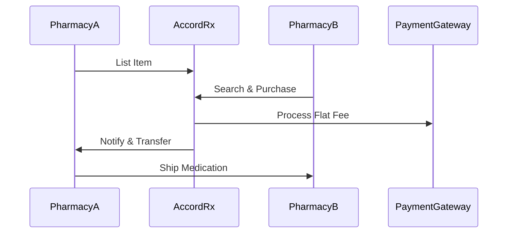

## Overview

AccordRx provides essential tools for pharmacies to handle overstock inventory, procure medications, process transactions securely, track inventory, and protect sensitive data. You can list excess stock quickly, search for needed items from other pharmacies, complete sales with flat-rate pricing, generate reports for compliance, and rest assured with enterprise-grade security.

<Callout kind="info">
AccordRx focuses on simplicity and compliance with DSCSA requirements, ensuring all transactions meet legal standards.
</Callout>

## Key Features

Explore the core capabilities through these feature cards.

<Columns cols={3}>
  <Card title="Inventory Management" icon="package" href="#inventory-management">
    List, edit, and remove overstock items with real-time updates.
  </Card>
  <Card title="Smart Search" icon="search" href="#search">
    Find medications by NDC, strength, or quantity across verified pharmacies.
  </Card>
  <Card title="Secure Transactions" icon="credit-card" href="#transactions">
    Process payments and transfers with flat fees and automated reporting.
  </Card>
  <Card title="Reporting Dashboard" icon="bar-chart-3" href="#reporting">
    Track sales, purchases, and inventory with exportable reports.
  </Card>
  <Card title="Data Protection" icon="shield" href="#security">
    Encrypt data and audit logs for full compliance.
  </Card>
</Columns>

## Listing and Managing Overstock Inventory

Efficiently manage your excess medications to avoid waste and generate revenue.

### Quick Listing Process

<Steps>
  <Step title="Add New Item" icon="plus">
    Navigate to the Inventory tab and click `Add Overstock`.

    ```javascript
    // Example API call for listing (if integrating programmatically)
    const response = await fetch('https://api.example.com/v1/inventory', {
      method: 'POST',
      headers: { 'Authorization': 'Bearer YOUR_TOKEN' },
      body: JSON.stringify({
        ndc: '12345-6789',
        name: 'Lisinopril 10mg',
        quantity: 50,
        price: 0.50
      })
    });
    ```
  </Step>
  <Step title="Edit Details" icon="edit-3">
    Update quantity, price, or expiration date. Changes sync instantly.
  </Step>
  <Step title="Mark as Sold" icon="check-circle">
    Once purchased, remove from listing and update your stock.
  </Step>
</Steps>

<Expandable title="Advanced Inventory Options" default-open="false">
Use bulk upload via CSV for multiple items:

````csv
NDC,Name,Quantity,Price,Expiration
12345-6789,Lisinopril 10mg,50,0.50,2025-12-31
98765-4321,Atorvastatin 20mg,30,0.75,2025-11-15
````
</Expandable>

## Searching and Purchasing Medications

Locate and buy overstock from trusted pharmacies effortlessly.

<Tabs>
  <Tab title="Buyer View" icon="shopping-bag">
    Enter NDC or drug name to filter results by price, quantity, and location.

    <Image
      src="https://accordrx.com/wp-content/uploads/2023/08/Experienced-Pharmacist-Alt.png"
      alt="Pharmacist reviewing search results on AccordRx dashboard"
      width="600"
      height="400"
    />
  </Tab>
  <Tab title="Seller View" icon="package">
    Monitor listing views and inquiries in real-time.
  </Tab>
</Tabs>

## Transaction Processing and Payments

Handle end-to-end transactions with minimal fees.



<Callout kind="tip" title="Flat-Rate Savings">
Pay one monthly fee regardless of transaction volume—save thousands compared to percentage-based platforms.
</Callout>

## Inventory Tracking and Reporting

Maintain accurate records for compliance and business insights.

| Report Type | Description | Export Format |
|-------------|-------------|---------------|
| Sales Summary | Monthly revenue from overstock sales | PDF, CSV |
| Purchase History | Items bought with lot numbers | CSV |
| Inventory Audit | Current stock levels and expirations | Excel |

<CodeGroup tabs="Dashboard API,Webhook">
```javascript
// Fetch reports via API
const reports = await fetch('https://api.example.com/v1/reports/sales?month=2024-10', {
  headers: { 'Authorization': 'Bearer YOUR_TOKEN' }
}).then(r => r.json());
```
````javascript
// Webhook for real-time updates
// POST https://your-webhook-url.com/webhook
{
  "event": "inventory_updated",
  "item": { "ndc": "12345-6789", "quantity": 25 }
}
````
</CodeGroup>

## Security and Data Protection

AccordRx prioritizes your data with robust measures.

- **Encryption**: All data in transit and at rest uses AES-256.
- **Authentication**: Multi-factor authentication (MFA) required.
- **Compliance**: Full DSCSA serialization and audit trails.
- **Access Logs**: Review who accessed what, when.

<Callout kind="alert" title="Best Practice">
Enable MFA and review access logs weekly to maintain security.
</Callout>

Ready to explore? Check the [Quickstart](/quickstart) for hands-on setup.