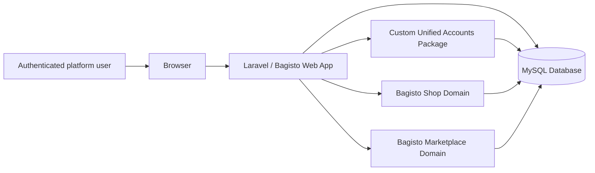
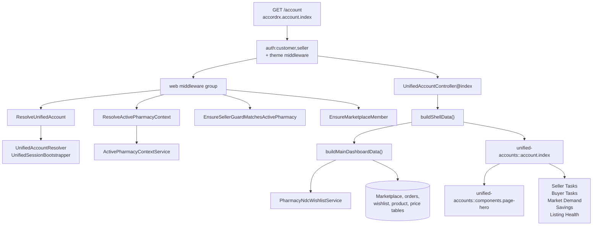
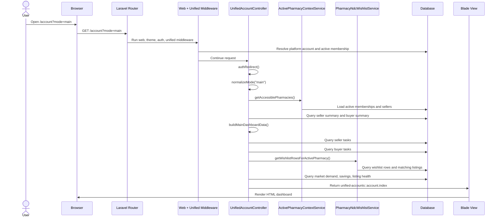
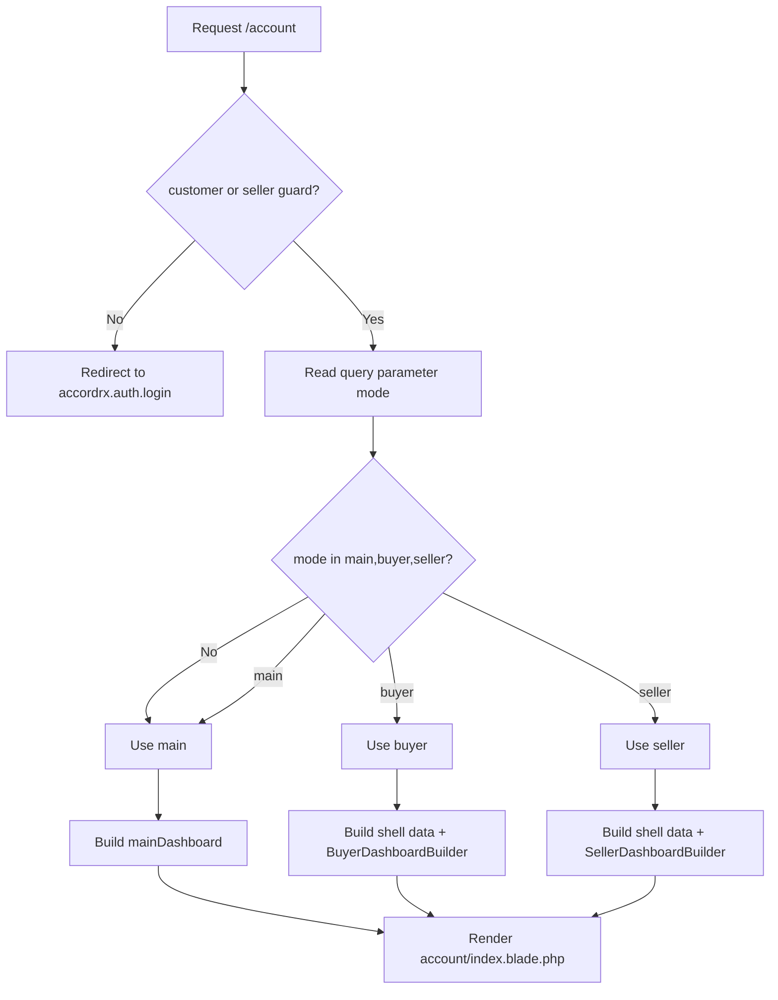
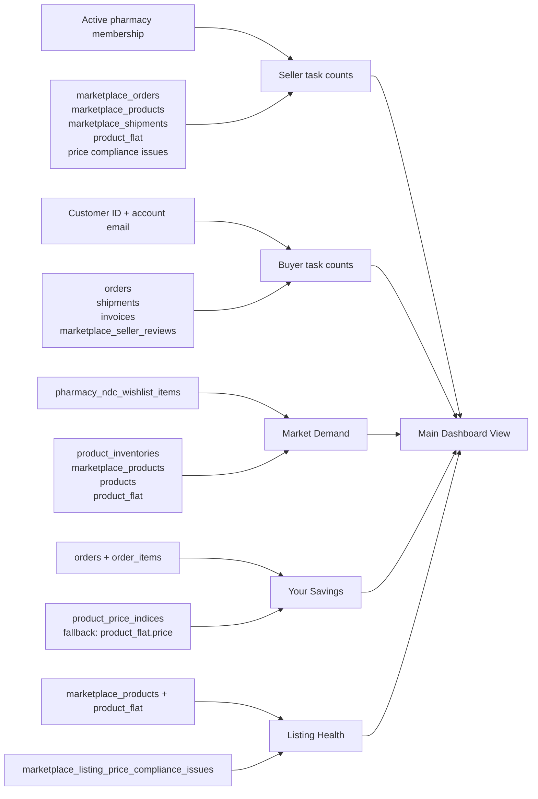

# Feature Documentation: Main Dashboard

## 1. Overview

The Main Dashboard is the unified account landing experience at `GET /account?mode=main`, route name `accordrx.account.index`. It is implemented in the Custom Unified Accounts package and rendered by `unified-accounts::account.index`.

The feature gives a logged-in AccordRx marketplace user a single action center that combines buyer-side and seller-side work into one page. It answers two practical questions:

- What needs my attention as a seller for the active pharmacy?

- What needs my attention as a buyer for my unified/customer account?

- What market, savings, and listing-health signals should I review next?

The page is part of a three-mode unified dashboard shell:

- `mode=main`: Main Account Dashboard, documented here.

- `mode=buyer`: Buyer Dashboard, rendered by `BuyerDashboardBuilder`.

- `mode=seller`: Seller Dashboard, rendered by `SellerDashboardBuilder`.

Primary actors:

- Platform account user, represented by `platform_accounts`.

- Customer guard user, represented by `customers`.

- Seller guard user, represented by `marketplace_sellers`.

- Active pharmacy membership, represented by `platform_account_pharmacy_memberships`.

- Marketplace/order systems, represented by Bagisto and marketplace tables.

The Main Dashboard itself is server-rendered Blade. It does not call an AJAX endpoint for its primary payload. The controller builds all task cards and insight cards before returning the view.

## 2. Goals and Design Intent

The feature was designed as a high-signal landing page for unified accounts. Before this dashboard, buyer and seller operational work lived in separate Bagisto and marketplace surfaces. The Main Dashboard reduces that context switching by summarizing both roles in one request.

Key design decisions:

- The selected mode comes from the `mode` query parameter, not from session state.\
  This is explicitly documented in `UnifiedAccountController::buildShellData()` as an M1 decision because storing mode in session caused stale buyer/seller context to bleed between navigation events.

- The page always falls back to `main` for invalid modes.\
  `UnifiedAccountController::normalizeMode()` accepts only `main`, `buyer`, and `seller`.

- Seller task data is scoped to the active pharmacy membership.\
  The active membership comes from `ActivePharmacyContextService`, and seller links are only emitted when the membership has the required permission.

- Buyer task data is scoped by customer ID and account email.\
  `applyBuyerIdentityScope()` matches `orders.customer_id` and/or `LOWER(orders.customer_email)` so unified sessions can still show buyer data when one identity path is missing.

- The implementation is defensive around optional schema.\
  Many calculations check `Schema::hasTable()` or `Schema::hasColumn()` and degrade to zero counts or empty collections when optional feature tables are absent.

- Dashboard task cards link into existing datagrid task presets.\
  The dashboard does not duplicate list pages. It generates URLs such as `seller.orders.index?task=new_orders` and `seller.products.index?task=auto_disabled`, and the receiving datagrids apply the filtering.

Non-goals:

- The Main Dashboard is not a real-time dashboard.

- It does not persist dashboard state.

- It does not execute seller or buyer actions directly.

- It does not replace buyer or seller dashboards; it links to focused workflows.

Security and maintainability considerations:

- The `/account` route is protected by `auth:customer,seller`.

- Seller links are permission-gated by membership role.

- Active pharmacy context is resolved centrally by middleware and service code.

- The controller uses query builders and bound parameters rather than raw interpolated user input for identity and task-related queries.

- Schema checks keep local/staging environments with incomplete migrations from fataling, but this also means missing tables silently produce empty dashboard data.

## 3. Architecture Context

The feature lives inside the Custom Unified Accounts package:

- Route: `packages/Custom/UnifiedAccounts/src/Routes/web.php`

- Controller: `Custom\UnifiedAccounts\Http\Controllers\UnifiedAccountController`

- Main view: `packages/Custom/UnifiedAccounts/src/Resources/views/account/index.blade.php`

- Shared hero view: `packages/Custom/UnifiedAccounts/src/Resources/views/components/page-hero.blade.php`

- Context service: `Custom\UnifiedAccounts\Services\ActivePharmacyContextService`

- Wishlist matching service: `Custom\ProductOverrides\Services\PharmacyNdcWishlistService`

- Related dashboard builders:

  - `Custom\UnifiedAccounts\Services\BuyerDashboardBuilder`

  - `Custom\UnifiedAccounts\Services\SellerDashboardBuilder`

Important middleware:

- `ResolveUnifiedAccount`

- `ResolveActivePharmacyContext`

- `EnsureSellerGuardMatchesActivePharmacy`

- `EnsureMarketplaceMember`

- Laravel route middleware `theme`

- Laravel auth middleware `auth:customer,seller`

Important internal tables:

- `platform_accounts`

- `platform_account_customer_links`

- `platform_account_pharmacy_memberships`

- `marketplace_sellers`

- `marketplace_orders`

- `marketplace_products`

- `marketplace_shipments`

- `marketplace_listing_price_compliance_issues`

- `orders`

- `order_items`

- `shipments`

- `invoices`

- `product_flat`

- `products`

- `product_inventories`

- `product_price_indices`

- `pharmacy_ndc_wishlist_items`

- `marketplace_seller_reviews`

Inside the application boundary:

- Laravel route, middleware, controller, Blade views, services, repositories, Eloquent models, query builders, Bagisto datagrids, database tables.

External dependencies:

- None directly for rendering the Main Dashboard.

- It depends on the current Bagisto channel, Laravel session/auth, and the local database.

- Related Unified Accounts package integrations such as search indexing, SMS, Reverb, shipping providers, and Mapbox exist elsewhere but are not called by the Main Dashboard request path.

## 4. Architecture Diagrams

### System Context Diagram



This shows that the Main Dashboard is an internal server-rendered feature. The browser requests `/account`, Laravel runs the web stack, Unified Accounts builds the dashboard payload, and Bagisto marketplace/shop tables provide most of the source data.

### Component Architecture Diagram



This diagram matters because most architectural decisions are made before rendering: middleware establishes account and active pharmacy context, then `buildShellData()` coordinates all dashboard inputs.

### Request Sequence Diagram



The sequence highlights the server-side nature of the dashboard. There is no separate primary API request for the main cards.

### Mode Decision Flow



This shows why `/account`, `/account?mode=main`, and `/account?mode=not-a-real-mode` all land on the Main Dashboard.

### Dashboard Data Flow Diagram



This diagram separates the five major dashboard regions and their source tables.

## 5. End-to-End Flow

Primary flow:

1. User requests `GET /account?mode=main`.

2. `packages/Custom/UnifiedAccounts/src/Routes/web.php` routes the request to `UnifiedAccountController@index`.

3. Route middleware requires:

   - `theme`

   - `auth:customer,seller`

4. The global web middleware group also includes Unified Accounts middleware registered by `UnifiedAccountsServiceProvider`:

   - `ResolveUnifiedAccount`

   - `ResolveActivePharmacyContext`

   - `EnsureSellerGuardMatchesActivePharmacy`

   - `EnsureMarketplaceMember`

   - `RedirectLegacyAccountRoutes`

5. `ResolveUnifiedAccount` resolves or provisions a `PlatformAccount` from the current customer or seller identity when unified accounts are enabled.

6. If a seller is authenticated without a customer guard, `ResolveUnifiedAccount` bootstraps a customer identity through `UnifiedSessionBootstrapper`.

7. `ResolveActivePharmacyContext` loads the default active membership and shares it into request attributes and views.

8. `EnsureSellerGuardMatchesActivePharmacy` reboots the seller guard to the active actor seller when necessary for `account*` and `seller*` requests.

9. `UnifiedAccountController@index()` calls `authRedirect()`.

   - If neither customer nor seller is authenticated, it redirects to `accordrx.auth.login`.

   - In normal route usage, `auth:customer,seller` should already enforce this.

10. The controller normalizes `mode`.

11. `buildShellData()` loads shared shell data:

- accessible pharmacy memberships

- active membership

- platform account

- pharmacy summaries

- buyer summary

- seller summary

- shared module URLs

- main dashboard payload

1. `buildMainDashboardData()` computes seller tasks, buyer tasks, market demand, savings, and listing health.

2. The controller returns `unified-accounts::account.index`.

3. The Blade view renders:

- shared hero with tabs and keyboard hotkeys

- seller task panel

- buyer task panel

- market demand card

- savings card

- listing health card

Alternate flows:

- Missing or invalid `mode`:

  - `mode` defaults to `main`.

  - Invalid values normalize to `main`.

- Customer-only unified session:

  - Seller guard may be absent.

  - Buyer counts still populate from customer ID/account email.

  - Seller counts remain zero or unlinkable unless an active seller membership exists.

- Seller-only session:

  - Middleware can ensure a shadow/customer identity.

  - Active seller membership may be created as a fallback if no platform account membership is available.

- Missing optional schema:

  - The controller checks table and column existence for optional data.

  - Missing tables produce safe default values, usually count `0`, empty arrays, or null URLs.

- Insufficient seller permissions:

  - Seller task counts and links depend on `membershipCan()`.

  - Owners always pass.

  - Custom roles require matching permissions such as `orders`, `orders.view`, `products`, `products.create`, `products.edit`, or `products.assign`.

  - If permission is missing, links are null and the card renders as disabled.

- No route available:

  - Some URLs are built only when `Route::has()` returns true.

  - Missing routes produce null URLs and disabled/non-clickable UI.

- Wishlist service failure:

  - `buildWishlistMatchesCount()` catches any throwable from `PharmacyNdcWishlistService::getWishlistRowsForActivePharmacy()` and returns `0`.

## 6. Code-Level Implementation

Main route:

```php
Route::get('account', [UnifiedAccountController::class, 'index'])
    ->name('accordrx.account.index');

```

Defined in:

- `packages/Custom/UnifiedAccounts/src/Routes/web.php`

Primary controller methods:

- `UnifiedAccountController::index(Request $request)`

  - Auth guard fallback.

  - Normalizes mode.

  - Calls `buildShellData()`.

  - Returns `unified-accounts::account.index`.

- `UnifiedAccountController::buildShellData(Request $request, string $mode)`

  - Resolves context.

  - Builds pharmacy summaries.

  - Builds buyer and seller summary aggregates.

  - Calls `buildMainDashboardData()` on every account request.

  - Only calls `BuyerDashboardBuilder::build()` when `mode=buyer`.

  - Only calls `SellerDashboardBuilder::build()` when `mode=seller`.

- `UnifiedAccountController::buildMainDashboardData($activeMembership, int $customerId, string $accountEmail)`

  - Builds the full Main Dashboard payload.

- `UnifiedAccountController::buildMarketDemandData(int $currentChannelId)`

  - Aggregates top three wishlisted NDCs by distinct watcher pharmacy count.

- `UnifiedAccountController::resolveMarketDemandMetadata(array $normalizedNdcs, int $currentChannelId)`

  - Enriches NDC demand rows with product name, package size, and NDC display data from product/inventory/listing tables.

- `UnifiedAccountController::buildYourSavingsData(int $customerId, string $accountEmail, int $currentChannelId)`

  - Compares ordered item paid totals to `product_price_indices.regular_min_price`.

  - Falls back to `product_flat.price` when price index rows are unavailable.

- `UnifiedAccountController::buildListingHealthData(int $activePharmacySellerId, bool $canViewSellerProducts, int $autoDisabledCount)`

  - Computes total/enabled/disabled active listings for the active pharmacy.

  - Carries active price compliance issue count into `autoDisabledListings`.

- `UnifiedAccountController::buildWishlistMatchesCount()`

  - Uses `PharmacyNdcWishlistService` to count unique marketplace seller/product pairs matching the active pharmacy wishlist.

- `UnifiedAccountController::applyBuyerIdentityScope($query, int $customerId, string $accountEmail, string $table = 'orders')`

  - Applies buyer identity scope with customer ID and/or lowercased customer email.

- `UnifiedAccountController::membershipCan($membership, array $keys)`

  - Determines whether the active membership can access seller order/product workflows.

Views:

- `packages/Custom/UnifiedAccounts/src/Resources/views/account/index.blade.php`

  - Main dashboard CSS and markup.

  - Mode switch.

  - Includes buyer/seller partials only for buyer/seller mode.

  - For main mode, renders task panels and insight cards.

- `packages/Custom/UnifiedAccounts/src/Resources/views/components/page-hero.blade.php`

  - Shared hero component.

  - Supports tabs and single-key hotkeys.

  - Main dashboard tabs use:

    - `m` for Main

    - `b` for Buyer

    - `s` for Seller

Related datagrid integrations:

- `packages/Custom/UnifiedAccounts/src/DataGrids/Orders/SellerOrdersDataGrid.php`

  - Applies seller task presets such as `new_orders`, `to_ship`, `ready_to_ship`, and `overdue_shipments`.

- `packages/Webkul/Shop/src/DataGrids/OrderDataGrid.php`

  - Applies buyer task presets such as `pending_payment`, `invoices_awaiting_download`, and `tracked_processing`.

- `packages/Custom/ProductOverrides/src/DataGrids/Seller/ProductDataGrid.php`

  - Applies seller product task presets such as `auto_disabled`, `expiring_inventory`, `priced_above_market`, `priced_too_low`, and `stale_listings`.

Reusable abstractions:

- `ActivePharmacyContextService` centralizes active platform account and pharmacy membership resolution.

- `PharmacyNdcWishlistService` centralizes wishlist row and listing-match logic.

- `SellerDashboardBuilder` constants are reused by dashboard links and datagrid filters.

- The page hero component is shared across multiple unified account pages.

## 7. Data Model and Persistence

The Main Dashboard does not create, update, or delete data. It reads from existing domain tables and renders derived metrics.

Core unified account tables:

- `platform_accounts`

  - Created by `2026_02_22_120000_create_platform_accounts_table.php`.

  - Important fields:

    - `email`

    - `password`

    - `first_name`

    - `last_name`

    - `status`

    - `last_active_pharmacy_seller_id`

    - `last_login_at`

  - `last_active_pharmacy_seller_id` references `marketplace_sellers.id`.

- `platform_account_customer_links`

  - Created by `2026_02_22_120100_create_platform_account_customer_links_table.php`.

  - Links one platform account to one Bagisto customer.

  - `customer_id` is unique.

- `platform_account_pharmacy_memberships`

  - Created by `2026_02_22_120200_create_platform_account_pharmacy_memberships_table.php`.

  - Important fields:

    - `platform_account_id`

    - `pharmacy_seller_id`

    - `actor_seller_id`

    - `role_key`

    - `marketplace_role_id`

    - `membership_status`

  - Unique key: `platform_account_id + pharmacy_seller_id`.

  - Additional indexes added by `2026_03_04_000000_add_missing_indexes_to_unified_accounts_tables.php`:

    - `pa_pm_account_pharmacy_idx`

    - `pa_pm_pharmacy_seller_idx`

    - `pa_pm_actor_seller_idx`

Buyer pharmacy scope:

- `cart.buyer_pharmacy_seller_id`

- `orders.buyer_pharmacy_seller_id`

- `shipments.buyer_pharmacy_seller_id`

These are added by `2026_02_22_120400_add_buyer_pharmacy_seller_id_to_cart_orders_shipments.php`.

Wishlist demand:

- `pharmacy_ndc_wishlist_items`

  - Created by `2026_03_09_130000_create_pharmacy_ndc_wishlist_items_table.php`.

  - Important fields:

    - `pharmacy_seller_id`

    - `channel_id`

    - `ndc_display`

    - `ndc_normalized`

    - `dating_limit_days`

    - `price_limit`

    - `created_by_platform_account_id`

  - Unique key:

    - `pharmacy_seller_id + channel_id + ndc_normalized`

Price compliance and listing health:

- `marketplace_listing_price_compliance_issues`

  - Created by `2026_03_21_090100_create_marketplace_price_monitor_tables.php`.

  - Important fields:

    - `marketplace_product_id`

    - `product_id`

    - `seller_id`

    - `ndc_normalized`

    - `listing_price`

    - `reference_price`

    - `max_allowed_price`

    - `delisted_at`

    - `resolved_at`

    - `is_active`

    - `active_key`

    - `reason_code`

  - Relevant indexes:

    - `mp_price_issue_active_key_unique`

    - `mp_price_issue_marketplace_product_idx`

    - `mp_price_issue_product_idx`

    - `mp_price_issue_seller_idx`

    - `mp_price_issue_ndc_idx`

    - `mp_price_issue_active_idx`

Seller task query sources:

- `marketplace_orders`

- `marketplace_shipments`

- `shipments`

- `marketplace_products`

- `product_flat`

- `marketplace_listing_price_compliance_issues`

Buyer task query sources:

- `orders`

- `shipments`

- `invoices`

- `marketplace_orders`

- `marketplace_seller_reviews`

Savings query sources:

- `orders`

- `order_items`

- `product_price_indices`

- fallback `product_flat.price`

Important invariants:

- Main seller task counts are scoped to the active pharmacy seller ID.

- Seller task links require active membership permissions.

- Buyer task counts are scoped by customer ID or account email.

- Market demand is channel-scoped when `pharmacy_ndc_wishlist_items.channel_id` exists.

- Listing health only returns counts when the active membership can view products.

Caching:

- No application-level cache is used for the dashboard payload.

- Laravel compiled Blade view cache applies to the view layer.

- Database query results are computed per request.

Search indexing:

- The Main Dashboard does not write search indexes.

- The Unified Accounts provider registers search observers elsewhere, but they are outside this request path.

Object storage:

- Not used by the Main Dashboard.

## 8. Integration Points

### Laravel Routing and Middleware

Purpose:\
Protect the dashboard and prepare unified context.

Direction:\
Browser to application.

Contract:\
`GET /account?mode=main|buyer|seller`

Failure handling:\
Unauthenticated users are redirected to `accordrx.auth.login`.

Security:\
Uses `auth:customer,seller` and unified middleware.

Retry behavior:\
No automatic retry.

### Active Pharmacy Context

Purpose:\
Determine which pharmacy seller the user is acting through.

Direction:\
Controller and middleware to `ActivePharmacyContextService`.

Contract:

- `getCurrentPlatformAccount(): ?PlatformAccount`

- `getAccessiblePharmacies(): Collection`

- `getActiveMembership(): ?PlatformAccountPharmacyMembership`

- `resolveDefaultMembership(): ?PlatformAccountPharmacyMembership`

Failure handling:\
Falls back to seller-session membership when platform account or membership tables are unavailable.

Security:\
Membership lookups are platform-account scoped.

### Marketplace Orders

Purpose:\
Compute seller tasks and seller summary counts.

Direction:\
Application reads database.

Contract:\
Reads `marketplace_orders.status`, `marketplace_seller_id`, `order_id`, and joined `orders.created_at`.

Failure handling:\
If `marketplace_orders` is missing, seller task counts default to zero.

### Shipments

Purpose:\
Compute seller To Ship/Overdue counts and buyer In Transit counts.

Direction:\
Application reads database.

Contract:\
A shipment is treated as tracked when `shipments.track_number` is non-null and not blank.

Failure handling:\
If `shipments` or `marketplace_shipments` is missing, related counts default to zero.

### Product Listings

Purpose:\
Compute auto-disabled, expiring inventory, listing health, and market demand metadata.

Direction:\
Application reads database.

Contract:\
Uses `marketplace_products`, `product_flat`, `products`, and `product_inventories`.

Failure handling:\
Missing tables or columns return zero/empty values.

### Pharmacy NDC Wishlist

Purpose:\
Compute buyer wishlist matches and market demand.

Direction:\
Application reads database through `PharmacyNdcWishlistService` and query builder.

Contract:\
Wishlist rows contain normalized NDC, optional dating limit, optional price limit, channel, and pharmacy seller ID.

Failure handling:\
`buildWishlistMatchesCount()` catches service exceptions and returns `0`.

### Price Indices

Purpose:\
Compute buyer savings.

Direction:\
Application reads database.

Contract:\
Uses `product_price_indices.regular_min_price` as the comparable market/reference price.

Failure handling:\
If no price index rows match, the controller falls back to `product_flat.price`.

### Datagrid Task Presets

Purpose:\
Turn dashboard cards into filtered operational lists.

Direction:\
Dashboard links to existing datagrid routes.

Contracts:

- `seller.orders.index?task=new_orders`

- `seller.orders.index?task=to_ship`

- `seller.products.index?task=auto_disabled`

- `seller.products.index?task=expiring_inventory`

- `shop.customers.account.orders.index?task=pending_payment`

- `shop.customers.account.orders.index?task=invoices_awaiting_download`

- `accordrx.account.wishlist`

Failure handling:\
If a route does not exist or permissions are missing, URL becomes null and the card renders disabled.

## 9. Configuration and Environment Dependencies

Feature flags in `config/accordrx-unified.php`:

- `ACCORDRX_UNIFIED_ENABLED`

- `ACCORDRX_UNIFIED_LOGIN_ENABLED`

- `ACCORDRX_UNIFIED_LEGACY_FORWARDING_ENABLED`

- `ACCORDRX_ACTIVE_PHARMACY_CONTEXT_ENABLED`

- `ACCORDRX_STORE_SELECTOR_ENABLED`

- `ACCORDRX_PHARMACY_SCOPED_CART_ENABLED`

- `ACCORDRX_MEMBERS_ONLY_MARKETPLACE_ENABLED`

- `ACCORDRX_LEGACY_ACCOUNT_ROUTE_REDIRECTS_ENABLED`

- `ACCORDRX_LEGACY_ACCOUNT_ROUTE_REDIRECT_STATS_ENABLED`

- `ACCORDRX_LEGACY_ACCOUNT_ROUTE_BLOCK_ENABLED`

- `ACCORDRX_AUTO_CREATE_SHADOW_CUSTOMER`

- `ACCORDRX_LEGACY_SELLER_SESSION_SHIM_ENABLED`

Required runtime dependencies:

- Laravel session support.

- Customer and seller auth guards.

- Current Bagisto channel.

- Theme middleware, because the layout uses Bagisto theme assets.

- Unified Accounts service provider registered in `bootstrap/providers.php`.

- Database migrations for Unified Accounts and Product Overrides.

- Bagisto marketplace and sales tables.

Local/staging/production prerequisites:

- Run migrations.

- Ensure marketplace settings are enabled where seller task links are expected.

- Ensure current channel exists.

- Ensure `platform_accounts` and membership rows exist for full unified behavior.

- Ensure optional Product Overrides migrations exist for market demand, wishlist, and price compliance features.

Deployment notes:

- Clear compiled views after framework or component namespace changes:

  - `php artisan view:clear`

- If route/config changes are cached in production, refresh Laravel caches as appropriate.

## 10. Security and Risk Considerations

Authentication:

- `/account` requires `auth:customer,seller`.

- `UnifiedAccountController::authRedirect()` also redirects to `accordrx.auth.login` if both guards are missing.

Authorization:

- Seller tasks are controlled by active membership and `membershipCan()`.

- Owners have full access.

- Roles with `permission_type=all` have full access.

- Roles containing `*` have full access.

- Custom roles require at least one permission key requested by the task:

  - Seller order tasks: `orders` or `orders.view`

  - Seller product tasks: `products`, `products.create`, `products.edit`, or `products.assign`

Sensitive data:

- Platform account email and customer/seller identity are used for scoping.

- The dashboard does not expose raw email or secrets in the main cards.

- The non-production auth debug partial may expose guard/session context for debugging. It returns null in production through `buildAuthDebug()`.

Trust boundaries:

- Query parameters are untrusted.

- `mode` is allow-listed.

- `task` parameters are consumed by downstream datagrids and compared to known strings/constants.

- Buyer identity scope uses parameter binding for email values.

Abuse cases:

- A user could try `mode=seller` without seller membership. The page can render, but seller task links and counts are constrained by active membership and guard context.

- A user could try task URLs directly. Downstream seller/customer routes and datagrids still apply their own auth and active seller context.

- A stale session could point to a different platform account. `ResolveUnifiedAccount` validates customer email and seller membership linkage before accepting a session account.

Known risks and technical debt:

- Several dashboard methods live in `UnifiedAccountController`, which is large and handles many unified account concerns.

- Missing schema silently degrades metrics to zero, which is operationally safe but can hide deployment/migration issues.

- Main Dashboard queries are computed synchronously per request.

- Buyer `in_transit` and `reviews` task cards currently render with null URLs in the Main Dashboard.

- Overdue seller shipments link to `seller.orders.index?task=to_ship`, while the seller dashboard/datagrid also supports `overdue_shipments`; this appears intentional or at least currently implemented, but future developers should confirm desired navigation.

## 11. Observability and Operations

Direct Main Dashboard logging:

- The Main Dashboard request path does not emit dedicated logs for successful rendering or metric calculation.

- Wishlist match count swallows `PharmacyNdcWishlistService` failures and returns zero without logging.

Related logs:

- `ActivePharmacyContextService::setActivePharmacy()` logs:

  - `unified_context_switch.denied`

  - `unified_context_switch.success`

- `EnsureSellerGuardMatchesActivePharmacy` logs:

  - `unified_seller_guard.mismatch`

  - `unified_seller_guard.rebootstrap`

Troubleshooting common failures:

- Dashboard redirects to login:

  - Check customer/seller guard session.

  - Check `auth:customer,seller` middleware.

  - Check unified login/session middleware.

- Dashboard renders no seller task links:

  - Check active membership.

  - Check `role_key`, `marketplace_role_id`, and role permissions.

  - Check `seller.orders.index` and `seller.products.index` routes exist.

  - Check seller is approved and not suspended.

- Dashboard shows zero market demand:

  - Check `pharmacy_ndc_wishlist_items` exists.

  - Check rows have `ndc_normalized`.

  - Check channel ID matches current channel when `channel_id` exists.

- Dashboard shows zero savings:

  - Check buyer orders exist for current customer ID or account email.

  - Check `order_items.product_id` is populated.

  - Check `product_price_indices.regular_min_price` exists for current channel/customer group.

  - Check fallback `product_flat.price`.

- Dashboard shows wrong active pharmacy:

  - Check session keys:

    - `accordrx.unified_account_id`

    - `accordrx.active_pharmacy_seller_id`

    - `accordrx.active_actor_seller_id`

    - `accordrx.active_role_key`

  - Check `platform_accounts.last_active_pharmacy_seller_id`.

  - Check active membership rows.

- Avatar/component artifacts appear in the header:

  - Clear compiled Blade views with `php artisan view:clear`.

Operational signals worth adding later:

- Timing metrics for `buildMainDashboardData()`.

- Count of dashboard schema-degraded responses.

- Count of wishlist service exceptions.

- Cache hit/miss metrics if dashboard payload caching is added.

## 12. Testing and Quality Coverage

Primary test file:

- `packages/Webkul/Shop/tests/Feature/UnifiedAccounts/UnifiedAccountMainDashboardTest.php`

Important tested scenarios:

- `/account` defaults to Main mode.

- Main, Buyer, and Seller tabs render with page hero tabs and hotkeys.

- Invalid mode falls back to Main.

- Buyer mode and seller mode do not render Main Dashboard task panels.

- Buyer dashboard counts remain populated for customer-only unified sessions.

- Main Dashboard renders seller task counts and links:

  - New Orders

  - To Ship

  - Overdue Shipments

  - Auto-Disabled

  - Expiring Inventory

- Main Dashboard renders buyer task counts and links:

  - Pending Payment

  - In Transit

  - Reviews

  - Wishlist Matches

  - Invoices Awaiting Download

- Market Demand renders top wishlisted NDC data.

- Your Savings computes dollar and percentage savings.

- Listing Health computes total, enabled, disabled, and auto-disabled counts.

- Seller order datagrid task presets are applied.

- Seller product datagrid task presets are applied.

- Buyer order datagrid task presets are applied.

- Seller product creation wizard can prefill from an `ndc` query parameter.

Related test helpers:

- `packages/Webkul/Shop/tests/Feature/UnifiedAccounts/DashboardTestHelpers.php`

Related tests worth knowing:

- `packages/Webkul/Shop/tests/Feature/UnifiedAccounts/UnifiedAccountsAuthContextTest.php`

- `packages/Webkul/Shop/tests/Feature/UnifiedAccounts/UnifiedAdminSellerActionsTest.php`

- `packages/Webkul/Shop/tests/Feature/UnifiedAccounts/UnifiedHeaderMetricsTest.php`

- `packages/Webkul/Shop/tests/Feature/UnifiedAccounts/PharmacyNdcWishlistTest.php`

- `tests/Feature/UnifiedAccounts/RedirectLegacyAccountRoutesTest.php`

How to run the main dashboard feature test:

```php
php ./vendor/bin/pest packages/Webkul/Shop/tests/Feature/UnifiedAccounts/UnifiedAccountMainDashboardTest.php --compact

```

How to run the broader unified accounts feature suite:

```php
composer run test:unified-accounts

```

Known coverage gaps:

- No browser-level test was identified for visual layout or responsive behavior of the Main Dashboard.

- No explicit test was identified for missing optional tables producing zero/default values.

- No explicit test was identified for non-owner membership permissions suppressing seller task links.

- No explicit test was identified for `buildWishlistMatchesCount()` exception handling.

- No explicit performance/regression test was identified for query count or response time.

## 13. Example Scenarios

### Normal Case: Unified Buyer/Seller User

A platform account has:

- A linked customer.

- An active pharmacy membership.

- Pending seller orders.

- Buyer orders.

- Wishlist rows.

- Active marketplace listings.

Request:

```php
GET /account?mode=main

```

Expected behavior:

- Main hero renders “AccordRx Action Center” and “Main Account Dashboard”.

- Seller task panel shows non-zero counts and links to seller order/product datagrids.

- Buyer task panel shows order, shipment, review, wishlist, and invoice signals.

- Market Demand shows top three NDCs by distinct watcher pharmacy count.

- Savings shows calculated savings versus product price index.

- Listing Health shows enabled/disabled listing counts and auto-disabled count.

### Edge Case: Invalid Mode

Request:

```php
GET /account?mode=not-a-real-mode

```

Expected behavior:

- `normalizeMode()` returns `main`.

- Main Dashboard renders.

- Buyer Dashboard and Seller Dashboard partials do not render.

### Edge Case: Customer-Only Session

A user has a customer session and platform account but no seller guard.

Expected behavior:

- Buyer counts are still populated from customer ID and email.

- Seller-scoped values are empty/zero unless a fallback membership exists.

- Session keeps `accordrx.unified_account_id`.

### Edge Case: Missing Wishlist Table

If `pharmacy_ndc_wishlist_items` is not present:

- Market Demand returns:

  - `topWishlistedItems: []`

  - `viewTrendsUrl` if the seller reporting route exists

- Wishlist Matches count returns `0`.

### Failure Case: Unauthenticated User

Request:

```php
GET /account?mode=main

```

Without customer or seller auth:

- Route middleware blocks access.

- Controller fallback redirects to `accordrx.auth.login`.

### Failure Case: Active Membership Cannot View Products

If active membership exists but `membershipCan()` returns false for product permissions:

- Auto-Disabled count defaults to `0`.

- Expiring Inventory count defaults to `0`.

- Listing Health URL is null.

- Product task cards render disabled or without a link.

## 14. Maintenance and Extension Guidance

Where to change dashboard content:

- Add or change task cards in `UnifiedAccountController::buildMainDashboardData()`.

- Change Main Dashboard markup in `account/index.blade.php`.

- Change hero/tab behavior in `components/page-hero.blade.php`.

- Add task preset filtering in the receiving datagrid:

  - Seller orders: `Custom\UnifiedAccounts\DataGrids\Orders\SellerOrdersDataGrid`

  - Buyer orders: `Webkul\Shop\DataGrids\OrderDataGrid`

  - Seller products: `Custom\ProductOverrides\DataGrids\Seller\ProductDataGrid`

Safe extension pattern for a new dashboard card:

1. Add the count calculation to `buildMainDashboardData()`.

2. Guard optional tables/columns with `Schema::hasTable()` and `Schema::hasColumn()`.

3. Scope seller data by active membership.

4. Scope buyer data through `applyBuyerIdentityScope()`.

5. Gate seller links with `membershipCan()`.

6. Add or reuse a task query parameter on the destination datagrid.

7. Add feature tests in `UnifiedAccountMainDashboardTest.php`.

Risky areas:

- `UnifiedAccountController` is already large. New substantial calculations may be better moved into a dedicated `MainDashboardBuilder`.

- Cross-guard behavior is subtle. Do not bypass `ActivePharmacyContextService` or unified middleware.

- Do not persist `mode` in session.

- Do not add seller links without checking active membership permissions.

- Do not scope buyer data only by email or only by customer ID unless the intended edge cases are re-tested.

- Be careful with raw SQL in aggregate queries; keep user input parameterized.

Common pitfalls:

- Assuming optional Product Overrides tables exist in every environment.

- Forgetting current channel filters for wishlist/product data.

- Adding a dashboard URL without implementing the datagrid task filter.

- Counting shipments with blank `track_number` as shipped.

- Counting canceled/fraud orders in savings.

- Ignoring `product_flat.locale` when joining product metadata.

Recommended refactor if this grows:

- Extract `buildMainDashboardData()`, `buildMarketDemandData()`, `buildYourSavingsData()`, and `buildListingHealthData()` into a dedicated service such as `MainDashboardBuilder`.

- Keep `UnifiedAccountController` responsible for request mode and view selection only.

- Add instrumentation around builder execution time and schema fallback paths.

## 15. Open Questions / Follow-Up Work

Known limitations and follow-up candidates:

- Buyer `In Transit` and `Reviews` cards currently have no URL in Main mode.

- Overdue seller shipments currently link to the broader `to_ship` preset, not a specific overdue preset.

- Dashboard metrics are computed synchronously on every request.

- Missing optional schema produces silent zero values.

- There is no dedicated observability for dashboard payload build time or query failures.

- There is no browser/e2e visual coverage for the Main Dashboard layout.

- A dedicated `MainDashboardBuilder` would improve maintainability.

- Permission-specific tests for non-owner roles should be added.

- Schema-degraded behavior should be tested explicitly.

- Wishlist service exception handling should be logged or instrumented.

## 16. Appendix

### Relevant Routes

```php
GET  /account
name accordrx.account.index
controller Custom\UnifiedAccounts\Http\Controllers\UnifiedAccountController@index
middleware web, theme, auth:customer,seller

```

Related routes used by cards:

```php
GET /seller/orders?task=new_orders
name seller.orders.index

GET /seller/orders?task=to_ship
name seller.orders.index

GET /seller/products?task=auto_disabled
name seller.products.index

GET /seller/products?task=expiring_inventory
name seller.products.index

GET /customer/account/orders?task=pending_payment
name shop.customers.account.orders.index

GET /customer/account/orders?task=invoices_awaiting_download
name shop.customers.account.orders.index

GET /account/wishlist
name accordrx.account.wishlist

```

### Main Dashboard Payload Shape

```php
[
    'header' => [
        'eyebrow' => 'AccordRx Action Center',
        'title' => 'Main Account Dashboard',
        'description' => 'Actionable Information Regarding Your Marketplace Activity',
    ],
    'sellerTasks' => [
        [
            'key' => 'new_orders',
            'title' => 'New Orders',
            'count' => 1,
            'description' => '1 pending review',
            'url' => '...',
            'accent' => 'default',
        ],
    ],
    'buyerTasks' => [
        [
            'key' => 'pending_payment',
            'title' => 'Pending Payment',
            'count' => 1,
            'description' => '1 order pending payment',
            'url' => '...',
            'accent' => 'default',
        ],
    ],
    'marketDemand' => [
        'topWishlistedItems' => [
            [
                'rank' => 1,
                'title' => 'Atorvastatin 40mg (90ct)',
                'ndc' => '00093-3151-98',
                'watchers' => 3,
                'watchersText' => '3 Watchers',
            ],
        ],
        'viewTrendsUrl' => '...',
    ],
    'yourSavings' => [
        'totalSaved' => 30.0,
        'savedPercent' => 30.0,
    ],
    'listingHealth' => [
        'totalListings' => 3,
        'enabledListings' => 2,
        'disabledListings' => 1,
        'autoDisabledListings' => 1,
        'url' => '...',
    ],
]

```

### Task Presets

Seller order presets:

```php
new_orders
to_ship
new_orders_recent
awaiting_confirmation
ready_to_ship
overdue_shipments

```

Buyer order presets:

```php
pending_payment
invoices_awaiting_download
tracked_processing

```

Seller product presets:

```php
auto_disabled
expiring_inventory
priced_above_market
priced_too_low
priced_below_market
close_to_buyer_demand
inventory_expiring_60
inventory_expiring_90
stale_listings

```

### Useful Test Commands

```php
php ./vendor/bin/pest packages/Webkul/Shop/tests/Feature/UnifiedAccounts/UnifiedAccountMainDashboardTest.php --compact

```

```php
composer run test:unified-accounts

```

### Useful Cache Command

```php
php artisan view:clear

```

### Important Files

```php
packages/Custom/UnifiedAccounts/src/Routes/web.php
packages/Custom/UnifiedAccounts/src/Http/Controllers/UnifiedAccountController.php
packages/Custom/UnifiedAccounts/src/Services/ActivePharmacyContextService.php
packages/Custom/UnifiedAccounts/src/Resources/views/account/index.blade.php
packages/Custom/UnifiedAccounts/src/Resources/views/components/page-hero.blade.php
packages/Custom/UnifiedAccounts/src/DataGrids/Orders/SellerOrdersDataGrid.php
packages/Webkul/Shop/src/DataGrids/OrderDataGrid.php
packages/Custom/ProductOverrides/src/DataGrids/Seller/ProductDataGrid.php
packages/Webkul/Shop/tests/Feature/UnifiedAccounts/UnifiedAccountMainDashboardTest.php
packages/Webkul/Shop/tests/Feature/UnifiedAccounts/DashboardTestHelpers.php

```

